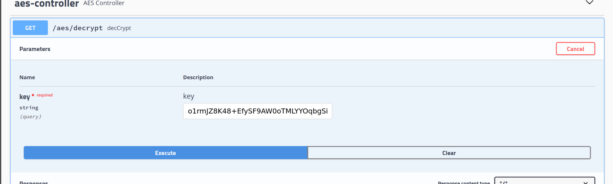

# LK-PRACTICES

- [Описание](#Описание)
- [Как запускать](#как-запускать)

## Описание

В сервисе practices реализован функционал практических работ 1, 2, 3 (пока первой) в рамках Криптографические методы защиты
информации. Алфавит - английский, 26 символов. Написание не учитывается. Символы, 
не входящие в рассматриваемый алфавит, не участвуют в шифровании/расшифровании

Для облегчения взаимодействия пользователя с сервисом был использован swagger-ui. Сваггер позволяет визуализировать 
API. Для просмотра API необходимо после запуска jar в браузере прописать http://localhost:8080/swagger-ui.html

### Практическая работа 1
Для простой замены смотрите раздел: substitution-cipher-controller

В substitution-cipher-controller можно загрузить свой ключ (по дефолту ключ заполнен) - uploadKey. Сгенерировать ключ (generateKey)
и вставить полученный json в Post-запрос uploadKey. Можно посмотреть последний загруженный ключ - getLastKey.
Можно зашифровать (encode) и расшифровать (decode) текст

Для аффинного шрифта: affine-cipher-controller

Для аффинного рекуррентного шрифта: affine-recurrent-cipher-controller

В разделах Affine-cipher-controller и Affine-recurrent-cipher-controller одинаковый набор эндпоинтов. Можно загрузить ключ/ключи, 
зашифровать/расшифровать текст. Для аффинного рекуррентного шифра необходимо загрузить 2 ключа.
Остальные ключи (по умолчанию 9998) будут сгенерированы после загрузки ключей.

Хочу отметить, перед тем, как приступать к расшифрованию/зашифрованию, необходимо загрузить ключи. Это правило
касается всех разделов.

### Практическая работа 2
Реализовала AES-шифр, ECB. Раздел AES Controller
Перед началом необходимо загрузить ключ длиной 16, 24 или 32 символов
Для этого необходибо вызвать эндпоинт:

После загрузки ключа появляется возможность зашифровать как введенную строку, 
так и содержимое файла формата txt

Для зашифрования отдельной строки необходимо использовать запрос:

Для зашифрования файла txt:

Эндпоинт /aes/encryptFile возвращает файл с зашифрованным текстом

Расшифрование. Расшифровывать можно как отдельную строку, так и содерживое файла .txt

Расшифрование отдельной строки:

Расшифрование содержимого файла txt:

Эндпоинт /aes/decryptFile на выходе дает возможность сказать файл с расшифрованным содержимым

Хочу отметить. Для упрощения работы зашифрованный текст перевожу в формат base64 (не слетает кодировка, так проще)

### Практическая работа 3
Раздел с запросами по практической 3 находится в этом разделе:

Реализовала при помощи библиотек java.security и org.bouncycastle подписание загружаемых файлов и валидацию 
подписи. Также пользователю предоставляется возможность генерировать ключи проверки подписи
или ключи подписи по ГОСТ Р 34.10-2012 с длиной 512 бит.
Плюс пользователь может сам загружать ключи проверки подписи и ключи подписи, но следует учесть,
что подписание и валидацие подписи работают у меня с ключами длиной 512 бит.

Для гененрации ключевой пары можно использовать эндпоинт:

Для получения текущей ключевой пары:

Подписать файл можно так:

Провалидировать подпись таким образом:

Загрузить ключ подписи (приватный ключ):

Загрузить ключ проверки подписи (публичный ключ):

Для упрощения работы также использую base64
## Как запускать

Для сборки сервиса необходимо выполнить команду:

gradlew clean build (для тех, кто скачает проект и запустит его локально)

Для запуска необходимо установить Java версии 11 и выполнить команду:

java -jar practices-unspecified.jar

